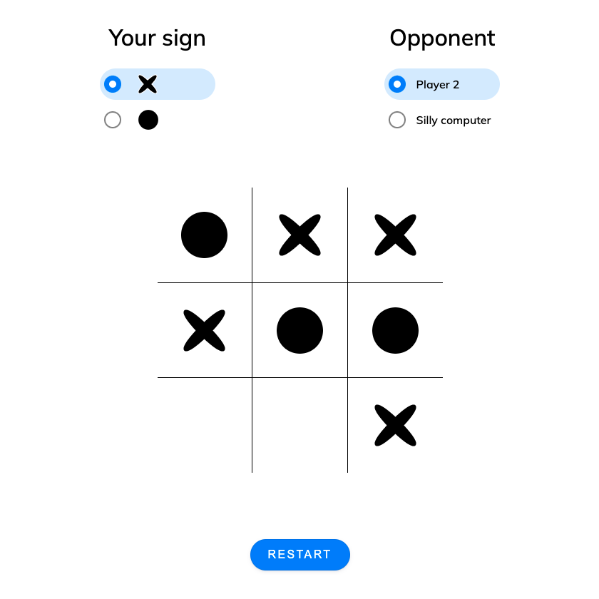

# Tic-Tac-Toe

[Check live](https://mrzadzinski.github.io/tic-tac-toe/)

Tic Tac Toe web app with minimalist interface

## Features
* PvP mode
* Random algorithm opponent

## Technologies
* JavaScript
* HTML
* CSS
    * SASS preprocessor

## Skills practiced
* Module pattern
    * Working with public and private scopes
    * Organizing code

## Acknowledgments
* This project was an assignment from The Odin Project course:
    * [Tic Tac Toe](https://www.theodinproject.com/lessons/node-path-javascript-tic-tac-toe) project

